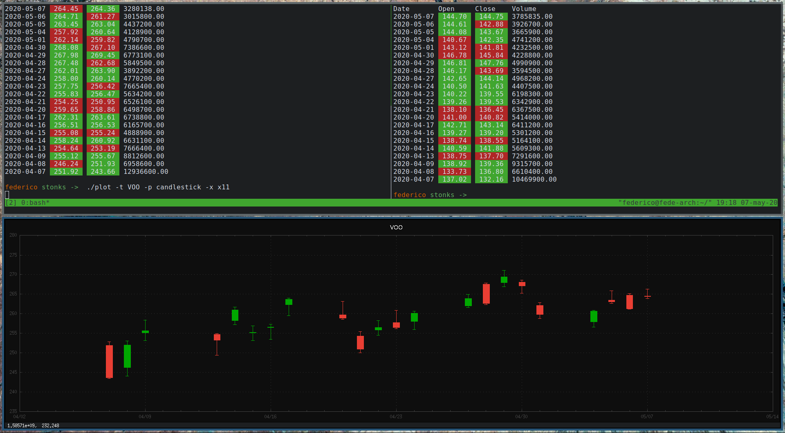

<pre>               
               /$$                         /$$               
              | $$                        | $$                
    /$$$$$$$ /$$$$$$    /$$$$$$  /$$$$$$$ | $$   /$$  /$$$$$$$
   /$$_____/|_  $$_/   /$$__  $$| $$__  $$| $$  /$$/ /$$_____/
  |  $$$$$$   | $$    | $$  \ $$| $$  \ $$| $$$$$$/ |  $$$$$$ 
   \____  $$  | $$ /$$| $$  | $$| $$  | $$| $$_  $$  \____  $$
   /$$$$$$$/  |  $$$$/|  $$$$$$/| $$  | $$| $$ \  $$ /$$$$$$$/
  |_______/    \___/   \______/ |__/  |__/|__/  \__/|_______/ 
                                                              
</pre>                                                          

#### The poor man's financial terminal.

A way to quickly get stock prices from yahoo finance and do some quick plotting
from the terminal.

## Requirements

* awk 5.1+
* gnuplot 5.2+

## Current features

* Get quotes from yahoo finance.
* Basic plotting (candlesticks and volume).

## Usage

The ticker script will fetch the symbols data from yahoo finance for the
specified period. Data is saved in the watchlist folder as a csv file for
each symbol requested.

* ticker [ -t TICKER ] [ -p PERIOD ]
    * TICKER: GOOG, AAPL, VOO, etc. (as in yahoo finance).
    * PERIOD: 1d, 1w, 1m, 1y

The plot scripts will plot the data for the given ticker already saved in the
watchlist folder.

* plot [ -t TICKER ] [ -t TYPE ] [ -x TERMINAL ]
    * TICKER: GOOG, AAPL, VOO, etc. (as in yahoo finance).
    * TYPE: candle, vol
    * TERMINAL: qt, x11, dumb, etc.

## Screenshots

## To- do, some day, maybe...
* [ ] Add line plots.  #1e020452
* [ ] Add basic indicators.  #ab73a98c
    * [ ] RSI.  #1d1daf05
    * [ ] MACD.  #0bd944d6
    * [ ] SMA.  #294c51bc
* [ ] Add other APIs.  #5effaa5d
